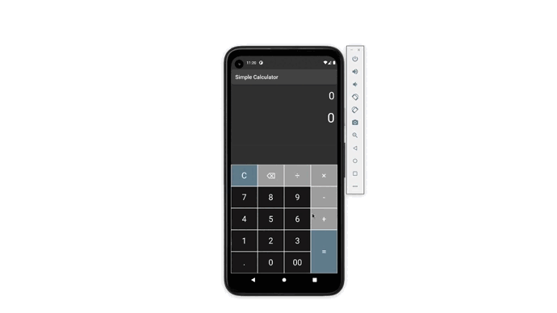

<h1 align="center">Calculator app</h1>
<h3 align="center">
Simple calculator
</h3>

<br />
 
<p align="center">
  
  
</p>

<br />



## Getting Started

```dart
$ git clone https://github.com/ariscybertech/aris_calculator.git
$ flutter packages get
```
Run the application and enjoy :tada::relaxed:

<a href="https://www.buymeacoffee.com/ariscybertech"></a>

• Perform basic calculations such as addition, subtraction, multiplication, and division
• Do scientific operations such as trigonometric, logarithmic, and exponential functions

- 🌱 I’m currently learning everything
     I’m looking to collaborate with other content creators
- 🥅 2021 Goals: Contribute more to Open Source projects
- ⚡ Fun fact: I love to draw and play guitar / drums
